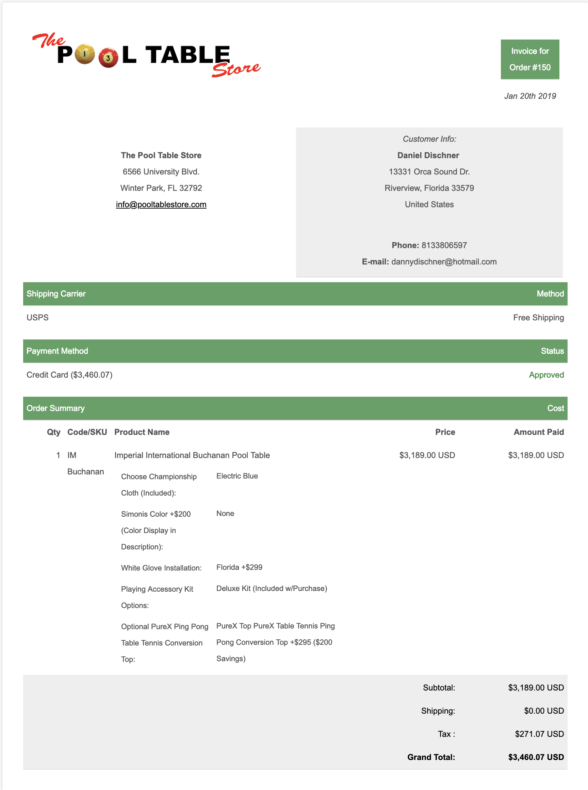

# BigCommerceInvoice
A modern, material design invoice template in HTML5, specifically written for BigCommerce's Stencil API

Forked from: https://github.com/sparksuite/simple-html-invoice-template

This was a five hour project at work, and the challenge was to redo their XHTML invoice template. I think this is a little more modern!

<h2>Before</h2>
<h4>Oversized Elements, Redundancy, No Invoice #, No Color Theory</h4>

<h2>After (My Redesign)</h2>
<h4>Simplified Layout, Modernized UI Elements, Dynamic/Responsive Content</h4>

<h2>Alternate Design</h2>
<h4>This Design is more in-tune with the Company Brand</h4>

